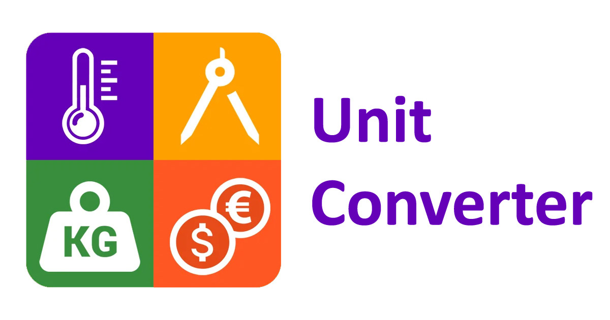

# UnitConverter_18

작성자: 서준교, 리뷰어: 김호진, 문희호, 박준혁, 방제민

## Unit Converter (Python)


### Overview
- 사용자가 입력한 길이(`단위:값`)를 기반으로, 해당 값을 다른 모든 단위로 변환해 출력하는 프로그램.
- 새로운 단위를 추가할 때 기존 코드의 변경이 최소화되도록 설계한다.
- 각 단위 변환 로직은 테스트 코드로 검증한다.

### spec 브랜치 산출 (문서 · 계약)

**권장 읽기 순서:** [Report/01](Report/01.UnitConverter_ProblemDefinition_Report.md) → [docs/PRD.md](docs/PRD.md) → [docs/INTERFACES.md](docs/INTERFACES.md) → [Report/02](Report/02.UnitConverter_Interface_Architecture_Report.md) → [Report/03](Report/03.UnitConverter_RED_TestPlan_Report.md) → [TODO_RED.md](TODO_RED.md)

#### 문서 · 계약 (spec ✅)

| 문서 | 설명 | spec |
|------|------|------|
| [docs/PRD.md](docs/PRD.md) | 기능·도메인·C2C 요구사항 | ✅ |
| [docs/INTERFACES.md](docs/INTERFACES.md) | 테스트용 인터페이스·불변식 SSOT | ✅ |
| [Report/01](Report/01.UnitConverter_ProblemDefinition_Report.md) | Mom Test · 문제 정의 | ✅ |
| [Report/02](Report/02.UnitConverter_Interface_Architecture_Report.md) | ECB · OCP/SRP · 구조 | ✅ |
| [Report/03](Report/03.UnitConverter_RED_TestPlan_Report.md) | RED 설계표 · 테스트 시나리오 | ✅ |
| [TODO_RED.md](TODO_RED.md) | RED 선행·실행 체크리스트 (상세 SSOT) | ✅ |
| [.cursorrules](.cursorrules) | 프로젝트 Rule (TDD·ECB) | ✅ |
| [reference.md](.cursor/skills/unit-converter-tdd/reference.md) | D-*/U-* Test ID 목록 | ✅ |
| [UnitConverter.py](UnitConverter.py) | 프로토타입 · 분석 기준 코드 ([Report/01](Report/01.UnitConverter_ProblemDefinition_Report.md) §6) | ✅ |

#### Cursor · Harness (red ⏳)

| 항목 | 설명 | spec |
|------|------|------|
| `unit-converter-tdd/SKILL.md` | RED/GREEN/REFACTOR 절차 | ⏳ red |
| `.cursor/commands/` (`/tdd-red`, `/review-ecb` 등) | TDD Command | ⏳ red |
| `pyproject.toml`, `src/`, `tests/` | ECB Harness · pytest | ⏳ red |

**계약 요약 (상세: [INTERFACES.md](docs/INTERFACES.md))**

| 항목 | 값 |
|------|-----|
| 기준 단위 | `meter` |
| 입력 형식 | `unit:value` (value ≥ 0) |

| 코드 | 의미 | 담당 |
|------|------|------|
| E001 | `:` 없음 (형식 오류) | boundary |
| E002 | 숫자 파싱 실패 | boundary |
| E003 | 미등록 단위 | boundary |
| E004 | 음수 | boundary |
| E005 | 빈 입력 | boundary |

**spec 완료 정의:** Report 03 RED 설계표 확정 · `INTERFACES` 계약 확정 · **`src/` 구현·Harness 미착수**. RED 진입 조건: [TODO_RED.md](TODO_RED.md) §1·§3.

**워크플로 (MagicSquare_XX 참고):** spec(설계) → **red**(pytest FAIL) → **green**(최소 구현) → refactor

### 가상환경 설정 및 실행
```bash
# 가상환경 생성
python -m venv venv

# 가상환경 활성화 (Windows)
venv\Scripts\activate

# 가상환경 활성화 (macOS/Linux)
source venv/bin/activate

# 실행
python UnitConverter.py

# 가상환경 비활성화
deactivate
```

### 기본 요구사항
1. 사용자 입력 예시:
   ```
   meter:2.5
   ```
   → 출력:
   ```
   2.5 meter = 8.2 feet
   2.5 meter = 2.7 yard
   ...
   ```

2. 현재 지원 단위:
   - meter
   - feet
   - yard

3. 새로운 단위가 추가될 때도 기존 코드의 변경이 최소화되도록 할 것.

4. 각 단위 간 변환이 정확히 계산되도록 테스트 코드를 작성할 것.

### 비즈니스 로직
- `1 meter = 3.28084 feet`
- `1 meter = 1.09361 yard`
- feet/yard 간의 비율은 meter 기반으로 계산.

### 품질 요구사항
- OCP를 만족하는 설계
- SRP를 만족하는 클래스 구성
- 입력 값 검증 (음수, 잘못된 형식, 없는 단위)

### 추가 요구사항
- **설정 외부화**
   - 변환 비율을 외부 설정 파일(JSON/YAML)에서 로드
- **동적으로 단위와 비율을 등록할 수 있도록 한다**
   - 사용자 입력으로 `1 cubit = 0.4572 meter`를 등록하고 사용 가능
- **출력 포맷 선택 기능** 
   - JSON / CSV / 표 형태 출력

### 아키텍처 (목표)

> ECB·Dual-Track 상세: [Report/02](Report/02.UnitConverter_Interface_Architecture_Report.md)

- **ECB:** `boundary → control → entity`
- **Dual-Track TDD:** Logic (`D-*`) + UI (`U-*`)
- **RED 우선:** pytest FAIL → GREEN → REFACTOR

| Track | Layer | 테스트 ID | 디렉터리 |
|-------|-------|-----------|----------|
| Logic | entity, control | `D-*` | `tests/entity/`, `tests/control/` |
| UI | boundary | `U-*` | `tests/boundary/` |

### 테스트 ID (브랜치 진행 요약)

> 전체 ID: [reference.md](.cursor/skills/unit-converter-tdd/reference.md) · RED 시나리오: [Report/03](Report/03.UnitConverter_RED_TestPlan_Report.md)

| ID | 요약 | spec | RED | GREEN |
|----|------|------|-----|-------|
| D-CVT-01 | feet ↔ meter | ✅ | ⏳ | ⏳ |
| D-CVT-03 | meter:2.5 → 전 단위 | ✅ | ⏳ | ⏳ |
| U-IN-01~05 | E001~E005 | ✅ | ⏳ | ⏳ |
| U-OUT-01~03 | 표/JSON/CSV 출력 | ✅ | ⏳ | ⏳ |
| D-REG-01 | cubit 등록 | ✅ | ⏳ | ⏳ |

### 프로젝트 구조

```
./
├── docs/                         # PRD, INTERFACES
├── Report/                       # 01~03
├── TODO_RED.md
├── .cursorrules
├── .cursor/skills/unit-converter-tdd/
│   └── reference.md
├── UnitConverter.py              # 프로토타입 (리팩터 대상)
├── src/entity, control, boundary   # ⏳ red/green
└── tests/                        # ⏳ red (RED 스켈레톤)
```

### Cursor 워크플로 (red 예정)

| Command | 역할 |
|---------|------|
| `/tdd-red` | RED: `tests/`만 · pytest FAIL |
| `/green-minimal` | RED 1묶음 최소 GREEN |
| `/review-ecb` | ECB·계약 정적 리뷰 |

## 생성형AI를 활용한 Activities (6 시간)

1. 문제 코드 및 기본 요구사항 분석 (0.5시간)
   - [UnitConverter.py](UnitConverter.py) 구조·로직 · [Report/01](Report/01.UnitConverter_ProblemDefinition_Report.md)
2. 기본 요구사항 및 품질 요구사항 구현 (2시간)
   - OCP를 만족하는 인터페이스 구현 
   - SRP를 만족하도록 클래스 구현 
   - 입력값 검증을 위한 구현
3. TC 구현 (0.5시간)
   - 단위변환 기능 검증 및 입력 값 검증 TC 작성 
4. 추가 요구사항 구현 (2시간)
   - 3개 요구사항 구현 및 TC 작성 
5. 회고 및 발표 (1시간)
   - 실습 목표와 달성도
   - AI를 어떻게 활용했나? 도움이 된 순간과 한계는?
   - TC를 추가보면서 개선에 미친 영향, TC 작성 팁
   - 클린코드와 리팩토링에서 느낀 장점과 어려운점
